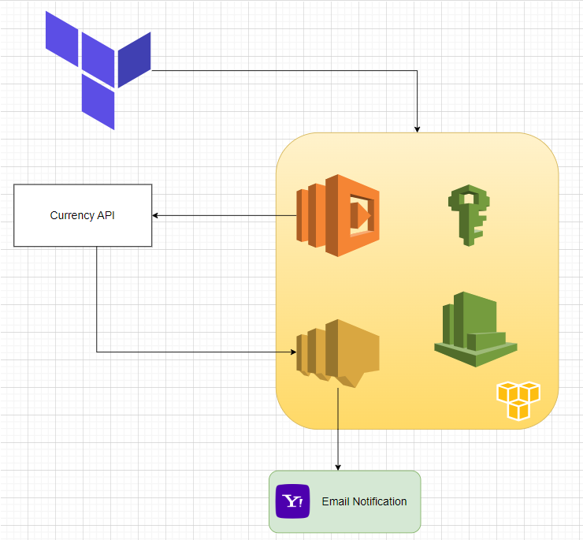

# Currency_automation
The system utilizes Terraform to create an AWS Lambda function that executes a Python script. This script makes an API call to retrieve the exchange rate for the RON currency from a specified API. Subsequently, the Lambda function sends a notification email with the exchange rate for the RON currency using AWS SNS.

The Lambda function is scheduled to run every day at 14:00 UTC using AWS CloudWatch. It fetches the exchange rate for the current day and sends the notification accordingly.

This automated process ensures that users receive daily updates on the exchange rate for the RON currency via email, providing them with timely and relevant information.

System diagram 

